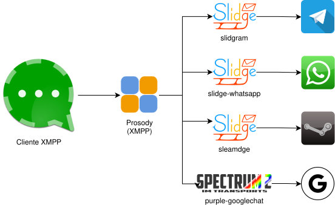

# Prosody + Gateways

Este proyecto monta un servidor XMPP con [Prosody](https://prosody.im/)  para usar como puente a otras redes. La arquitectura mostrada aquí esta diseñada
para montarla en una máquina `arm`, en concreto se ha probado
en una máquina `Ampere (ARM) VM.Standard.A1.Flex 4xCPUs 24GB RAM` de `Oracle Always Free` pero cambiando las imágenes usadas
(ver [`docker-compose.yml`](./docker-compose.yml)) puedes levantarlo donde quieras.

## Qué incluye

- [Prosody](./dk/Dockerfile.prosody) con los módulos necesarios
- Gateway [Slidge](https://slidge.im/) para acceder a:
   * Telegram
   * WhatsApp
   * Steam
- Gateway [Spectrum2](https://spectrum.im/) con [purple-googlechat](https://github.com/EionRobb/purple-googlechat) para acceder a:
   * Google Chat
- [Docker Compose](./docker-compose.yml) para levantar todos servicios
- FixBug de [purple-googlechat](./dk/Dockerfile.google) para que funcione correctamente
- Lanzador [`up.sh`](./up.sh)



## Requisitos previos

1. Una instancia ARM con Ubuntu o similar
2. Una IP pública asignada a la máquina
3. Un dominio DNS asignado a esa IP pública
3. Cuenta en las redes a las que queremos conectar
4. y en el caso concreto de Telegram un [API ID y API Hash](https://my.telegram.org)

## 1) Preparar el servidor

El servidor debe tener abierto los puertos:

- 80 (HTTP)
- 443 (HTTPS)
- 5222 (XMPP cliente)
- 5280 (BOSH)
- 5281 (HTTP upload / archivos)

## 2) Crear certificados

Como se verá en el siguiente punto, el script de configuración
espera obtener los certificado desde una ruta para copiarlos
al lugar indicado. Esto es así porque en mi máquina de despliegue
ya hay un [`Caddy`](https://caddyserver.com/) que se encarga de
generar los certificados, así que me limito a obtenerlos de donde
los deja `Caddy`.

Sin embargo puedes saltarte este paso y generar más adelante
unos certificados autofirmados de prueba.

## 3) Configurar el proyecto

```bash
chmod +x up.sh
cp env.example.txt .env
nano .env
```

Definir las variables que aparecen en [el ejemplo](./env.example.txt).
Puedes obviar `XMPP_CRT` y `XMPP_KEY` si vas a usar certificados autofirmados.

Nota: El usuario administrador (el que en el ejemplo aparece como `XMPP_ADMIN_NAME="admin"`) también va a a ser el que tu uses para conectarte, asi que si quieres cámbiale el nombre.

## 4) Levantar los contenedores

```bash
./up.sh
```

Este script a parte de levantar los contenedores, actualiza los certificados
y se asegura de que los volúmenes montados tienen los permisos y propietarios adecuados.

## 5) Crear certificados autofirmados

Si decidiste saltar el paso 2, ahora puedes crear los certificados autofirmados haciendo:

```bash
. .env
docker exec -it prosody prosodyctl cert generate "$XMPP_DOMAIN"
docker exec -it prosody prosodyctl --root cert import /var/lib/prosody/
```

## 6) Crear tu usuario en Prosody

```bash
. .env
docker compose exec prosody prosodyctl register "$XMPP_ADMIN_NAME" "$XMPP_DOMAIN" "$XMPP_ADMIN_PASSWORD"
```
## 8) Configurar los Gateways

Por comodidad, recomiendo hacerlo desde [Gajim](https://gajim.org/)
aunque se podría usar cualquier otro cliente que lo permita.

Los pasos a seguir son:

1. Conectarte con tu cuenta XMPP
2. Seleccionar en el menu *Cuentas* dicho usuario XMPP y luego *Descubrir servicios...*
3. Seleccionar el Gateway deseado y pulsar en *Comando*
4. Pulsar en *Registrar* y seguir las instrucciones

Posteriormente recomiendo explorar los otros comandos, como los de preferencias.

También veras que se te agrega como contacto unos usuarios que tienen
como nombre el del Gateway (en `Gajim` aparecen en el grupo *Transporte*).
Los que están hechos con [Slidge](https://slidge.im/) responderan al mensaje *help* con los comandos que puedes lanzarles desde ahí mismo
como si fueran un chatbot.

## 9) Usar

Una vez hecho esto, puedes irte a tu cliente XMPP favorito (ya sea [Gajim](https://gajim.org/), [Conversations](https://conversations.im/) o cualquier otro) y empezar a chatear con todo el mundo desde un solo cliente
muy superior a cualquier app privativa.